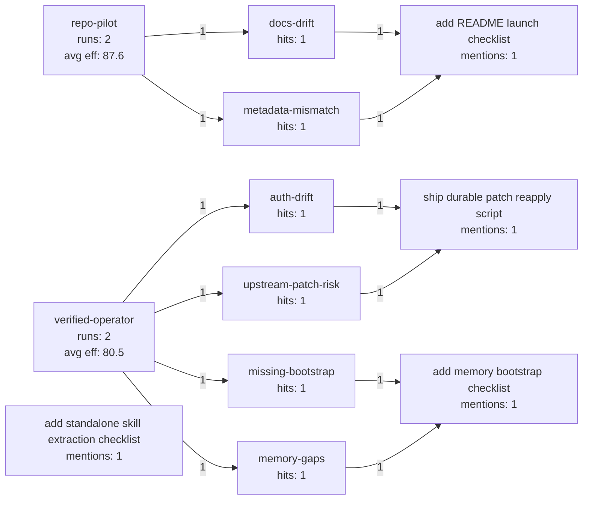

# Skill Effectiveness Report

Generated: `2026-03-22T02:48:49+00:00`

Tracked runs: **4**

## Usage Overview

| Skill | Runs | Avg efficiency | Delivery index | Avg friction | Avg duration |
| --- | ---: | ---: | ---: | ---: | ---: |
| repo-pilot | 2 | 87.6 | 100.0% | 1.5 | 16.0 min |
| verified-operator | 2 | 80.5 | 77.5% | 2.5 | 14.5 min |

## Challenge Hotspots

| Challenge tag | Hits | Skills impacted |
| --- | ---: | --- |
| docs-drift | 1 | repo-pilot |
| metadata-mismatch | 1 | repo-pilot |
| auth-drift | 1 | verified-operator |
| upstream-patch-risk | 1 | verified-operator |
| missing-bootstrap | 1 | verified-operator |
| memory-gaps | 1 | verified-operator |
| path-portability | 1 | repo-pilot |
| packaging-split | 1 | repo-pilot |

## Upgrade Backlog

| Upgrade candidate | Mentions | Skills helped | Avg friction behind it | Priority score |
| --- | ---: | --- | ---: | ---: |
| add memory bootstrap checklist | 1 | verified-operator | 3.0 | 30.0 |
| add standalone skill extraction checklist | 1 | repo-pilot | 2.0 | 20.0 |
| ship durable patch reapply script | 1 | verified-operator | 2.0 | 20.0 |
| add README launch checklist | 1 | repo-pilot | 1.0 | 10.0 |

## Graph

## Recent Runs

| Timestamp | Skills | Outcome | Eff. | Task |
| --- | --- | --- | ---: | --- |
| 2026-03-22T10:18:00+00:00 | repo-pilot | success | 91.2 | Tighten README repo layout and metadata copy |
| 2026-03-21T14:20:00+00:00 | repo-pilot | success | 84.0 | Split chrome-session-bridge into a standalone repo |
| 2026-03-18T09:42:00+00:00 | verified-operator | success | 84.9 | Fix local operator.read probe path |
| 2026-03-18T08:55:00+00:00 | verified-operator | partial | 76.1 | Bootstrap missing OpenClaw memory workspaces |

## How To Use This

- Log each notable skill run, especially when a task was harder than expected or produced a reusable lesson.
- Watch for repeated challenge tags. Once a tag appears more than once, it should usually become a template, checklist, script, or skill update.
- Use the upgrade backlog as the maintenance queue. Higher priority scores mean the same pain keeps showing up with real friction.
